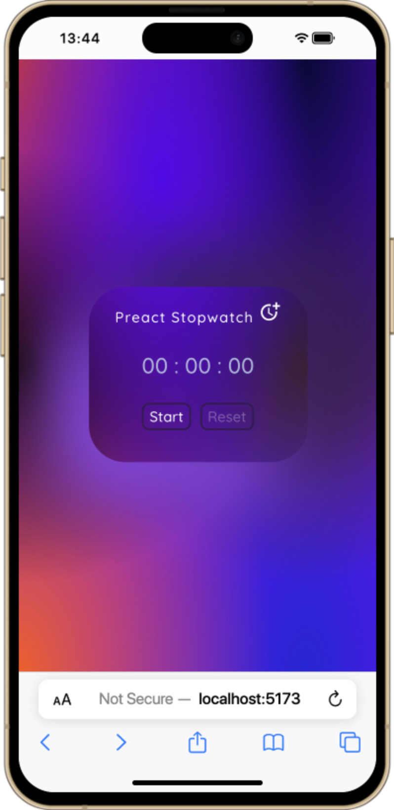
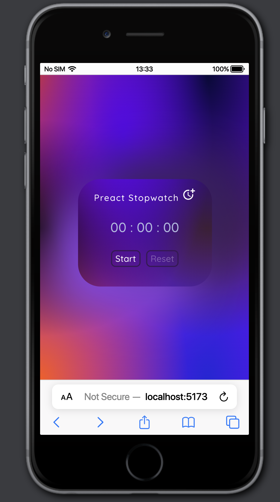
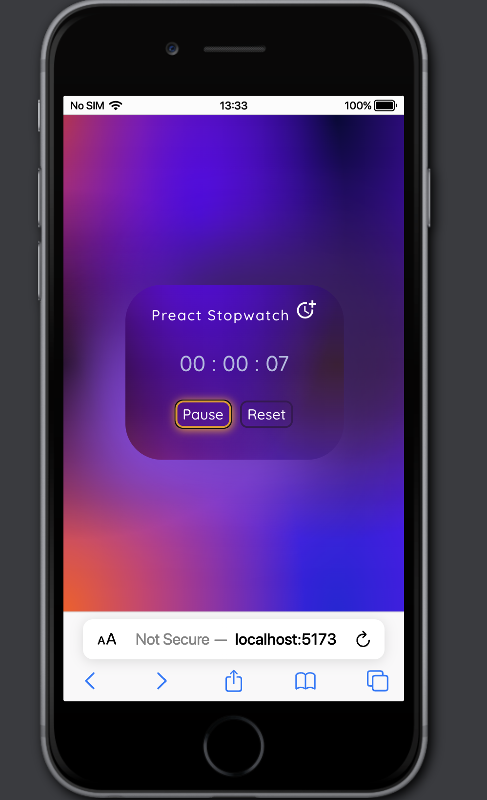
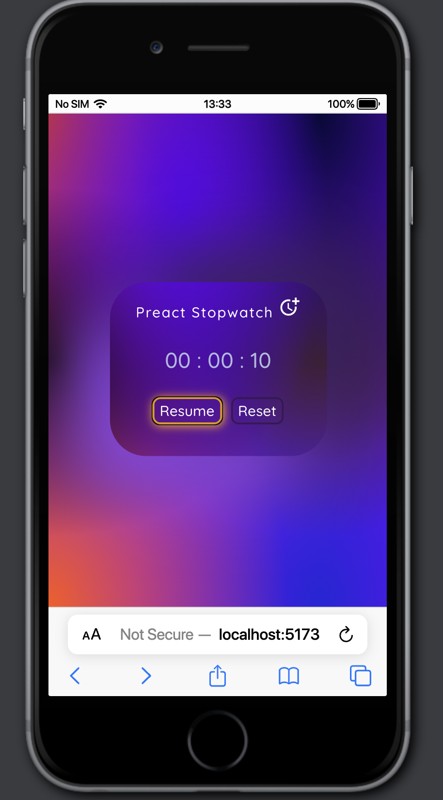

# Stopwatch with Preact
.   .   .    

### Prerequisites

To install the dependencies.
* npm
  ```sh
  npm install
  
* yarn
  ```sh
  yarn install
  
To run the project.
* npm
  ```sh
  npm start dev
  
* yarn
  ```sh
  yarn start dev
